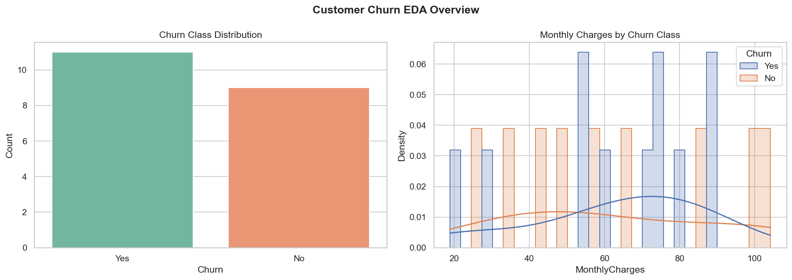
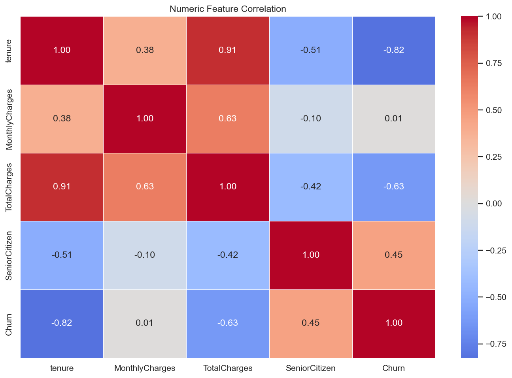
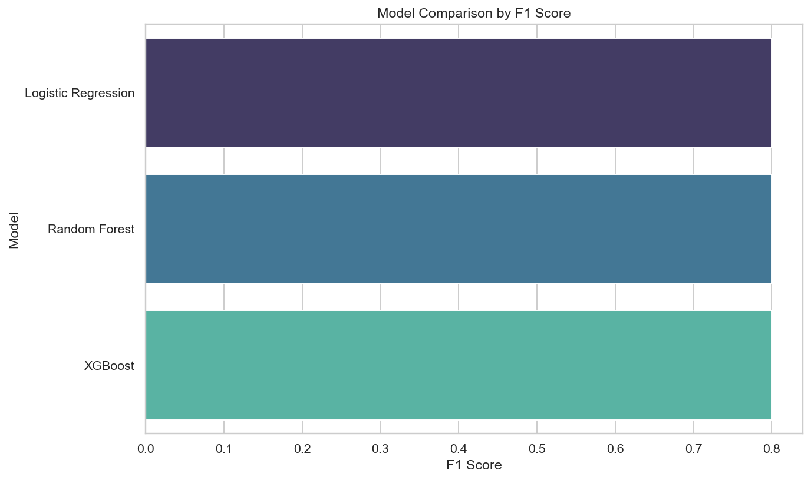
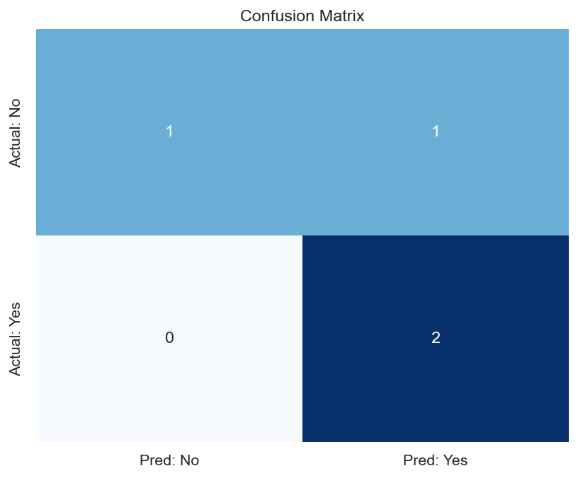
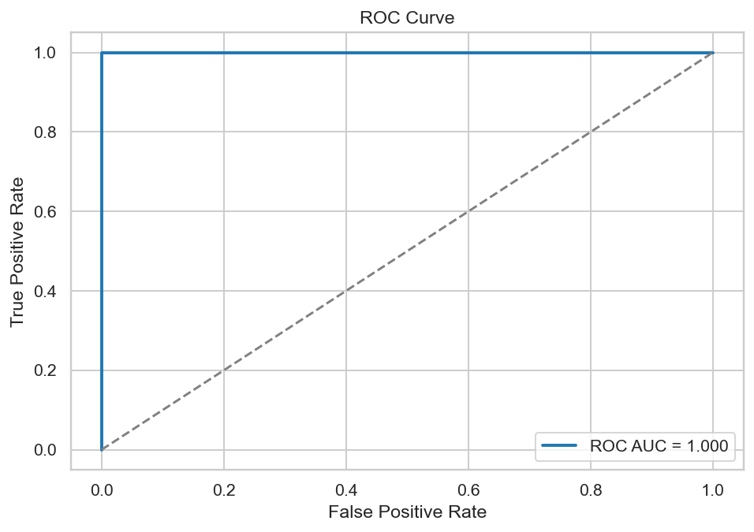
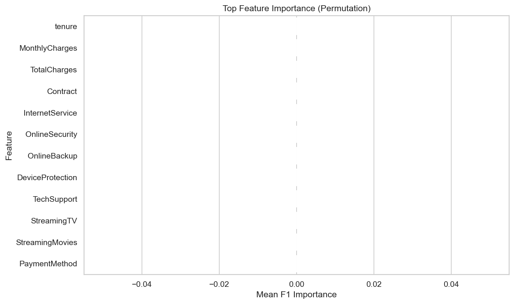
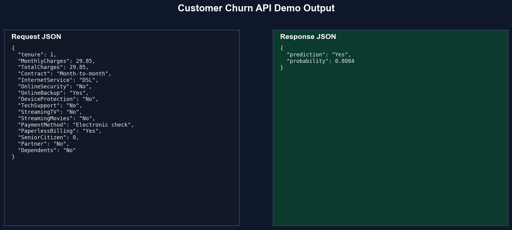

# Customer Churn Prediction

## Predicting At-Risk Telecom Customers Before Revenue Walks Out the Door


## 🎯 Problem Statement

Telecom churn silently erodes recurring revenue. High-risk users often leave before retention teams can act, especially when behavior changes are subtle across billing, tenure, and service usage patterns.

## 💡 Solution Overview

This project delivers a production-style churn intelligence system that:

- Trains robust binary classifiers with feature engineering and hyperparameter search.
- Returns both churn decision and calibrated probability for intervention workflows.
- Provides API-based real-time inference for customer success operations.
- Auto-generates recruiter-ready visuals and real outputs with a single command.

## 🏗️ System Architecture / Workflow

```text
Raw Churn Dataset
      |
      v
Data Validation + Train/Test Split
      |
      v
Feature Engineering + Preprocessing
      |
      v
Model Tuning (LogReg / RF / XGBoost)
      |
      v
Evaluation + Artifact Persistence
      |
      +--> FastAPI /predict
      |
      +--> Portfolio Showcase Generator (assets + output_samples)
```

## ⚙️ Tech Stack

- Python 3.11
- Pandas, NumPy
- scikit-learn, XGBoost
- Matplotlib, Seaborn
- FastAPI, Pydantic, Uvicorn
- Pytest

## 📊 Key Features

- Config-driven reproducible training pipeline.
- Robust schema-aware feature alignment for inference.
- Real-time API predictions with probability output.
- Automated model comparison and visual diagnostics.
- Portfolio showcase pipeline that generates all assets and JSON outputs automatically.

## 📈 Model Details

Models evaluated:

- Logistic Regression
- Random Forest
- XGBoost

Latest real run metrics:

- Best model: `logistic_regression`
- Accuracy: `0.7500`
- Precision: `0.6667`
- Recall: `1.0000`
- F1-score: `0.8000`
- ROC-AUC: `1.0000`
- Confusion matrix: TN=1, FP=1, FN=0, TP=2

Special techniques:

- Domain feature engineering (tenure grouping, service activity, billing patterns)
- Multi-model tuning via randomized search
- Feature-importance diagnostics via permutation importance

## 🖼️ Visual Outputs (Auto-Generated)









## 🔥 Live Predictions (Real Outputs)

Generated from the trained model and saved in `artifacts/output_samples.json`.

```json
{
  "input": {
    "tenure": 1,
    "MonthlyCharges": 29.85,
    "TotalCharges": 29.85,
    "Contract": "Month-to-month",
    "InternetService": "DSL",
    "OnlineSecurity": "No",
    "OnlineBackup": "Yes",
    "DeviceProtection": "No",
    "TechSupport": "No",
    "StreamingTV": "No",
    "StreamingMovies": "No",
    "PaymentMethod": "Electronic check",
    "PaperlessBilling": "Yes",
    "SeniorCitizen": 0,
    "Partner": "No",
    "Dependents": "No"
  },
  "output": {
    "prediction": "Yes",
    "probability": 0.8084
  }
}
```

```json
{
  "input": {
    "tenure": 58,
    "MonthlyCharges": 104.2,
    "TotalCharges": 6038.1,
    "Contract": "Two year",
    "InternetService": "Fiber optic",
    "OnlineSecurity": "Yes",
    "OnlineBackup": "Yes",
    "DeviceProtection": "Yes",
    "TechSupport": "Yes",
    "StreamingTV": "Yes",
    "StreamingMovies": "Yes",
    "PaymentMethod": "Credit card",
    "PaperlessBilling": "No",
    "SeniorCitizen": 0,
    "Partner": "Yes",
    "Dependents": "Yes"
  },
  "output": {
    "prediction": "No",
    "probability": 0.181
  }
}
```

## 🔌 API Usage

Endpoint:

- `POST /predict`

Run API:

```bash
uvicorn api.main:app --host 0.0.0.0 --port 8000 --reload
```

Request example:

```json
{
  "tenure": 10,
  "MonthlyCharges": 70,
  "TotalCharges": 700,
  "Contract": "Month-to-month",
  "InternetService": "Fiber optic",
  "TechSupport": "No",
  "PaymentMethod": "Electronic check"
}
```

Response example:

```json
{
  "predictions": [
    {
      "churn": "Yes",
      "probability": 0.82
    }
  ]
}
```

## 🧪 How To Run

Install dependencies:

```bash
python -m venv .venv
.venv\Scripts\activate
pip install -r requirements.txt
```

Train model:

```bash
python -m src.pipelines.training_pipeline
```

Generate full portfolio assets and real outputs:

```bash
python -m src.pipelines.portfolio_showcase_pipeline
```

Run tests:

```bash
pytest -q
```

## 📂 Project Structure

```text
customer_churn_prediction/
  api/
    main.py
  assets/
    eda_distribution.png
    missing_values.png
    correlation_heatmap.png
    model_comparison.png
    confusion_matrix.png
    roc_curve.png
    feature_importance.png
    api_response.png
  artifacts/
    train.csv
    test.csv
    metrics.json
    feature_schema.json
    model_comparison.csv
    binary_relevance_metrics.json
    output_samples.json
    showcase_assets_manifest.json
  data/
    raw/
      telco_churn.csv
  models/
    best_model.joblib
  notebooks/
    eda.ipynb
  src/
    components/
    config/
    exception/
    logger/
    pipelines/
    utils/
  tests/
```


