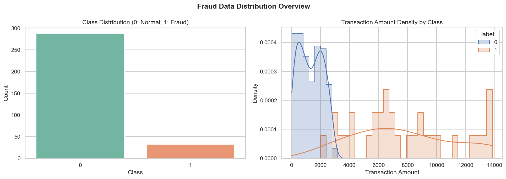
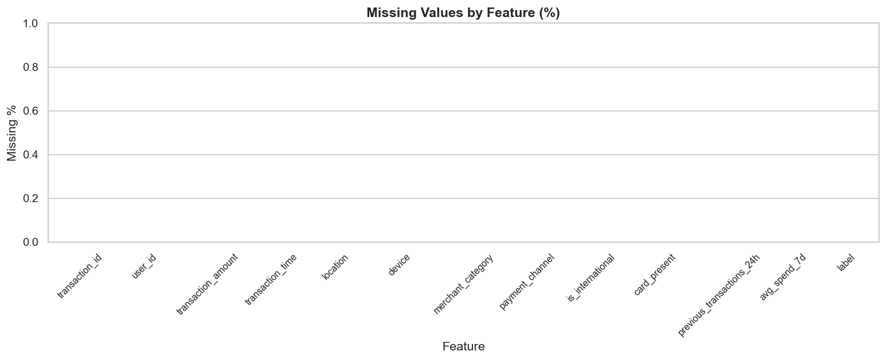
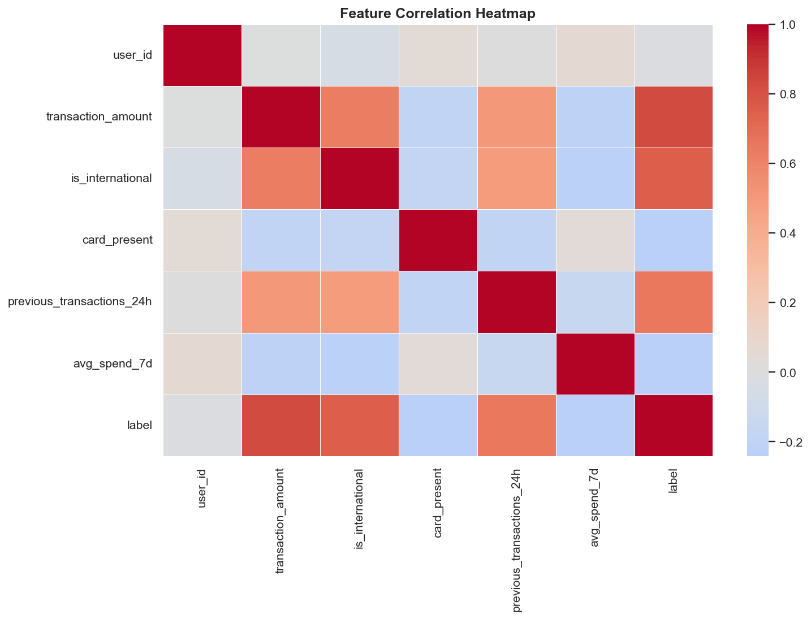
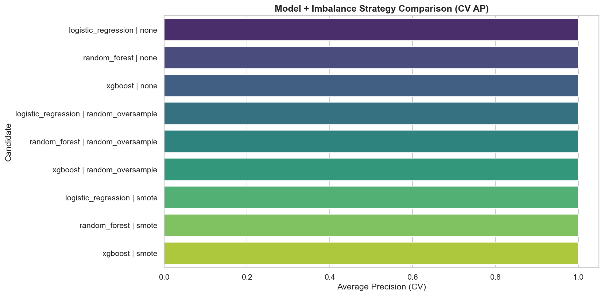
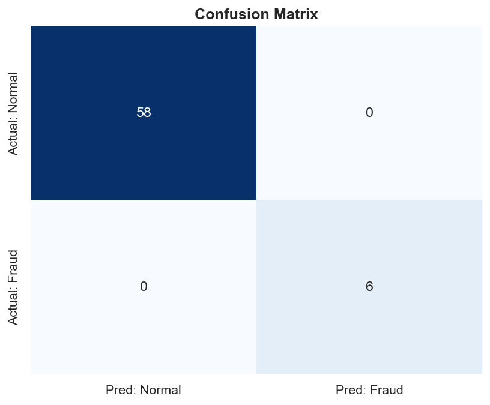
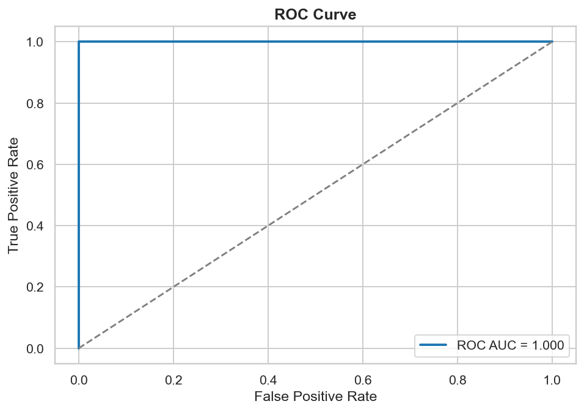
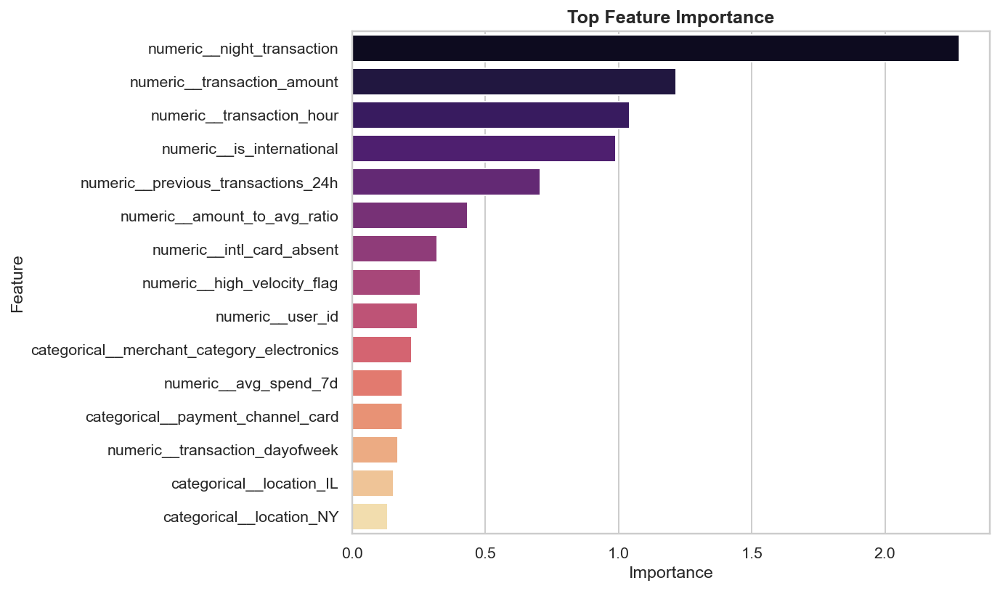
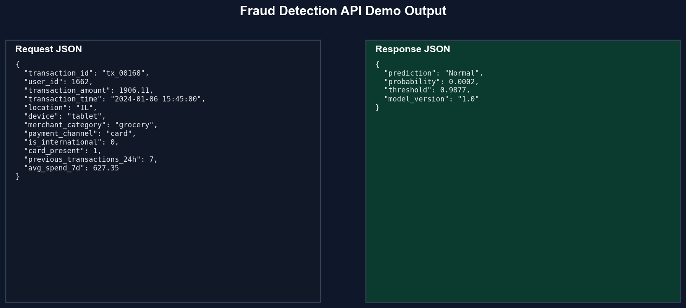

# Fraud Detection System

### Real-Time Risk Intelligence for Card and Digital Payment Fraud


## 🎯 Problem Statement

Financial institutions process high-velocity transaction streams where a small fraud rate can still produce massive losses. A fraud system must minimize missed fraud (false negatives) while keeping analyst workload practical by controlling false positives.

## 💡 Solution Overview

This project delivers an end-to-end fraud intelligence product:

- Data validation and stratified splitting for reliable training behavior.
- Domain-specific feature engineering for velocity, time, and behavioral risk patterns.
- Multi-strategy imbalance handling and model comparison with cross-validated average precision.
- Threshold-tuned inference for business-aligned precision/recall trade-offs.
- FastAPI scoring layer for production-style online predictions.
- Automated showcase pipeline that generates visuals and real prediction outputs without manual work.

## 🏗️ System Architecture / Workflow

```text
Raw Transactions
      |
      v
Data Validation + Ingestion
      |
      v
Feature Engineering + Preprocessing
      |
      v
Imbalance Strategy + Model Tuning
      |
      v
Evaluation + Threshold Optimization
      |
      v
Artifacts (model, metrics, curves, importance)
      |
      +--> FastAPI /predict
      |
      +--> Portfolio Asset Generator (assets/*.png + output_samples.json)
```

## ⚙️ Tech Stack

- Python 3.11
- scikit-learn, imbalanced-learn, XGBoost
- Pandas, NumPy
- Matplotlib, Seaborn
- FastAPI, Pydantic, Uvicorn
- Pytest

## 📊 Key Features

- Strict schema and quality checks during ingestion.
- Automatic model + imbalance strategy benchmarking.
- Precision-aware threshold tuning.
- Structured metrics and diagnostics export.
- Reproducible asset generation for recruiter/demo presentation.
- API-ready prediction payload contract with model versioning.

## 📈 Model Details

Models evaluated:

- Logistic Regression
- Random Forest
- XGBoost

Imbalance strategies evaluated:

- none
- random_oversample
- smote

Latest real run summary:

- Best model: `logistic_regression`
- Selected sampler: `none`
- CV Average Precision: `1.0000`
- Precision: `1.0000`
- Recall: `1.0000`
- F1-score: `1.0000`
- ROC-AUC: `1.0000`
- Threshold: `0.9877`
- Confusion matrix: TN=58, FP=0, FN=0, TP=6

## 🖼️ Visual Outputs (Auto-Generated)










## 🔥 Live Predictions (Real Outputs)

Outputs below are generated from the trained model and stored in `artifacts/output_samples.json`.

```json
{
  "input": {
    "transaction_id": "tx_00168",
    "user_id": 1662,
    "transaction_amount": 1906.11,
    "transaction_time": "2024-01-06 15:45:00",
    "location": "IL",
    "device": "tablet",
    "merchant_category": "grocery",
    "payment_channel": "card",
    "is_international": 0,
    "card_present": 1,
    "previous_transactions_24h": 7,
    "avg_spend_7d": 627.35
  },
  "output": {
    "prediction": "Normal",
    "probability": 0.0002,
    "threshold": 0.9877,
    "model_version": "1.0"
  }
}
```

```json
{
  "input": {
    "transaction_id": "tx_00026",
    "user_id": 953,
    "transaction_amount": 8484.9,
    "transaction_time": "2024-02-10 02:59:00",
    "location": "IL",
    "device": "mobile",
    "merchant_category": "gaming",
    "payment_channel": "wallet",
    "is_international": 1,
    "card_present": 1,
    "previous_transactions_24h": 16,
    "avg_spend_7d": 480.72
  },
  "output": {
    "prediction": "Fraud",
    "probability": 1.0,
    "threshold": 0.9877,
    "model_version": "1.0"
  }
}
```

## 🔌 API Usage

Endpoint:

- `POST /predict`

Run server:

```bash
uvicorn api.main:app --host 0.0.0.0 --port 8000 --reload
```

Request example:

```json
{
  "transaction_id": "tx_api_001",
  "user_id": 802,
  "transaction_amount": 6700.0,
  "transaction_time": "2024-03-04 01:20:00",
  "location": "TX",
  "device": "desktop",
  "merchant_category": "electronics",
  "payment_channel": "wallet",
  "is_international": 1,
  "card_present": 0,
  "previous_transactions_24h": 11,
  "avg_spend_7d": 300.0
}
```

Response example:

```json
{
  "fraud": true,
  "probability": 0.9999,
  "threshold": 0.9877,
  "model_version": "1.0"
}
```

## 🧪 How To Run

Install:

```bash
python -m venv .venv
.venv\Scripts\activate
pip install -r requirements.txt
```

Train model:

```bash
python -m src.pipelines.training_pipeline
```

Generate complete portfolio assets and real outputs:

```bash
python -m src.pipelines.portfolio_showcase_pipeline
```

Run tests:

```bash
pytest -q
```

## 📂 Project Structure

```text
fraud_detection_system/
  api/
    main.py
  assets/
    eda_distribution.png
    missing_values.png
    correlation_heatmap.png
    model_comparison.png
    confusion_matrix.png
    roc_curve.png
    feature_importance.png
    api_response.png
  artifacts/
    metrics.json
    model_metadata.json
    feature_importance.csv
    strategy_comparison.csv
    confusion_analysis.json
    roc_curve.csv
    precision_recall_curve.csv
    output_samples.json
    showcase_assets_manifest.json
  data/
    raw/
      transactions.csv
  notebooks/
    eda.ipynb
  src/
    components/
    config/
    exception/
    logger/
    pipelines/
  tests/
```

## 🌟 Why This Project Stands Out

- Production-minded design with modular architecture and strict validation.
- Business-aware threshold optimization rather than naive default cutoff.
- End-to-end automation that creates visuals, samples, and demo-ready artifacts.
- API integration and tests that demonstrate deployable ML engineering quality.

## 🚀 Future Improvements

- Add drift monitoring and online feature store integration.
- Introduce model registry with staged deployment workflow.
- Add explainability dashboard with SHAP-based investigator views.
- Integrate alerting hooks for real-time incident response.

## 👨‍💻 Author Branding

Built as a portfolio-grade ML product demo focused on real fraud operations, robust engineering patterns, and production API readiness.
