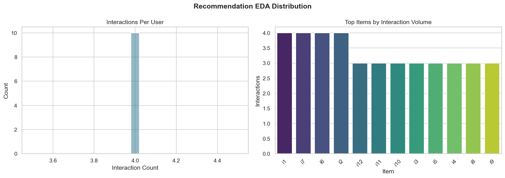
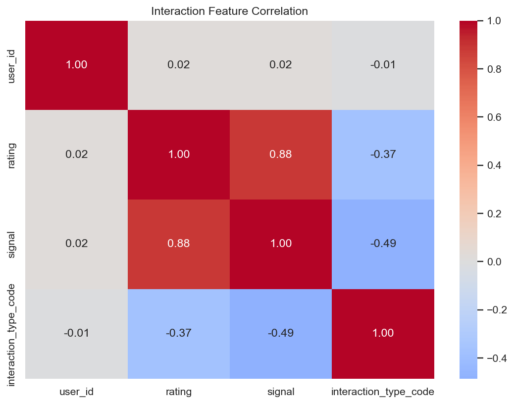
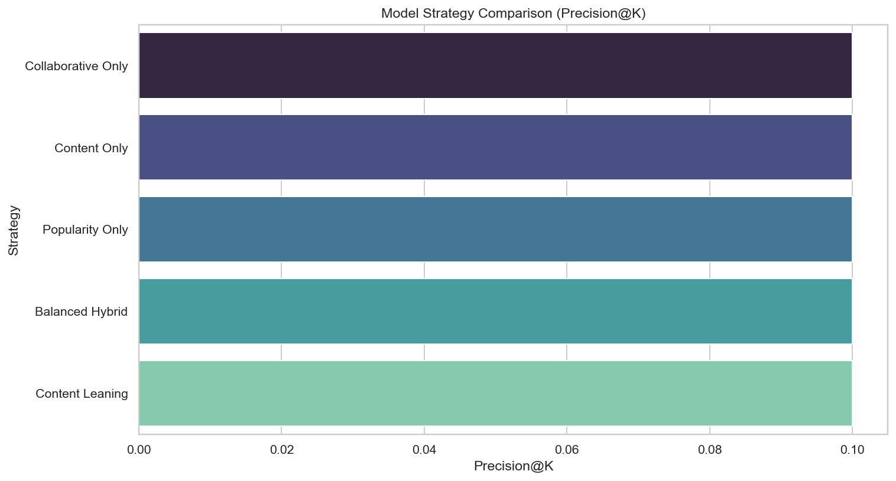
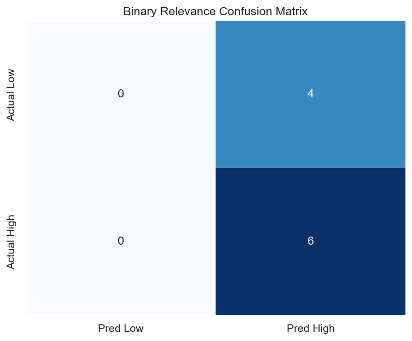
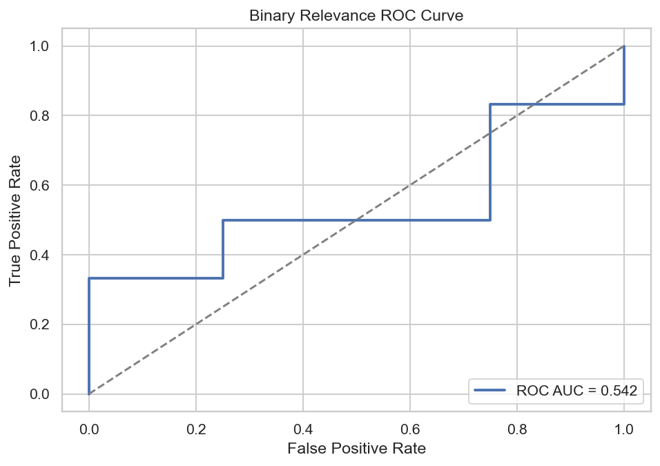
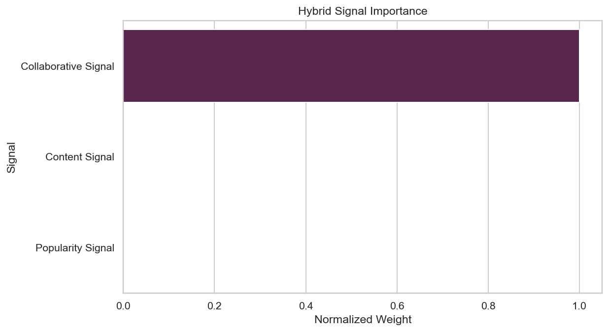
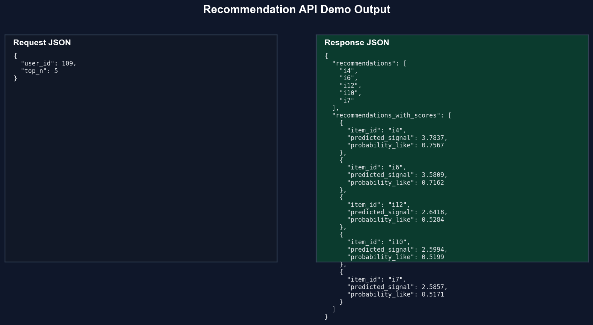

# Recommendation Engine

### Hyper-Personalized Content Delivery with Hybrid Ranking Intelligence


## 🎯 Problem Statement

Digital platforms must recommend the right items in milliseconds while balancing personalization quality, cold-start reliability, and operational simplicity. Weak recommendation systems reduce engagement, session depth, and conversion.

## 💡 Solution Overview

This project implements a production-style hybrid recommendation platform that combines:

- Collaborative filtering for behavioral similarity.
- Content-based ranking using item semantics.
- Popularity fallback to stabilize cold-start and sparse-user scenarios.

It includes full training, evaluation, API serving, and an automated showcase pipeline that generates visuals and real sample recommendations for recruiter/demo workflows.

## 🏗️ System Architecture / Workflow

```text
User-Item Interactions + Item Metadata
                |
                v
Data Validation + Preprocessing (signal engineering)
                |
                v
Hybrid Training (CF + Content + Popularity)
                |
                v
Weight Tuning + Offline Evaluation (Precision@K, Recall@K, RMSE)
                |
                +--> Model & Metrics Artifacts
                |
                +--> FastAPI /recommend Endpoint
                |
                +--> Portfolio Showcase Generator (assets + output_samples)
```

## ⚙️ Tech Stack

- Python 3.11
- Pandas, NumPy
- scikit-learn
- Matplotlib, Seaborn
- FastAPI, Pydantic, Uvicorn
- Pytest

## 📊 Key Features

- Modular architecture with isolated components and pipelines.
- Config-driven behavior for evaluation and serving constraints.
- Inference caching for repeated requests.
- Cold-start fallback via popularity priors.
- Real-time API layer with strict request validation.
- Fully automated portfolio artifact generation.

## 📈 Model Details

Algorithms and signals:

- Collaborative filtering (behavior-driven relevance)
- Content-based recommender (TF-IDF style semantic similarity)
- Popularity prior (robust fallback)
- Hybrid weighted aggregation

Latest real training/evaluation snapshot:

- Precision@K: `0.1000`
- Recall@K: `1.0000`
- RMSE: `1.9470`
- Hybrid weights: `cf=0.60`, `cb=0.30`, `pop=0.10`
- Data sparsity (train matrix): `0.75`
- Binary relevance ROC-AUC (diagnostic): `0.5417`

Special techniques:

- Per-user chronological split for realistic offline validation.
- Signal engineering from ratings + interaction types.
- Weight strategy benchmarking and explainable signal contribution chart.

## 🖼️ Visual Outputs (Auto-Generated)









## 🔥 Live Predictions (Real Outputs)

Generated from the trained model and stored in `artifacts/output_samples.json`.

```json
{
  "input": {
    "user_id": 109,
    "top_n": 5
  },
  "output": {
    "recommendations": ["i4", "i6", "i12", "i10", "i7"],
    "recommendations_with_scores": [
      {"item_id": "i4", "predicted_signal": 3.7837, "probability_like": 0.7567},
      {"item_id": "i6", "predicted_signal": 3.5809, "probability_like": 0.7162}
    ]
  }
}
```

```json
{
  "input": {
    "user_id": 102,
    "top_n": 5
  },
  "output": {
    "recommendations": ["i11", "i12", "i10", "i8", "i4"],
    "recommendations_with_scores": [
      {"item_id": "i11", "predicted_signal": 3.5922, "probability_like": 0.7184},
      {"item_id": "i12", "predicted_signal": 2.667, "probability_like": 0.5334}
    ]
  }
}
```

## 🔌 API Usage

Endpoint:

- `POST /recommend`

Run API:

```bash
uvicorn api.main:app --host 0.0.0.0 --port 8000 --reload
```

Request example:

```json
{
  "user_id": 101,
  "top_n": 5
}
```

Response example:

```json
{
  "recommendations": ["i6", "i9", "i2", "i11", "i1"]
}
```

Health check:

- `GET /health`

## 🧪 How To Run

Install dependencies:

```bash
python -m venv .venv
.venv\Scripts\activate
pip install -r requirements.txt
```

Train model:

```bash
python -m src.pipelines.training_pipeline
```

Generate complete showcase assets + real outputs:

```bash
python -m src.pipelines.portfolio_showcase_pipeline
```

Run tests:

```bash
pytest -q
```

## 📂 Project Structure

```text
recommendation_engine/
  api/
    main.py
  assets/
    eda_distribution.png
    missing_values.png
    correlation_heatmap.png
    model_comparison.png
    confusion_matrix.png
    roc_curve.png
    feature_importance.png
    api_response.png
  artifacts/
    metrics.json
    model_comparison.csv
    binary_relevance_metrics.json
    output_samples.json
    showcase_assets_manifest.json
  data/
    raw/
      interactions.csv
      items.csv
    processed/
  models/
    hybrid_recommender.joblib
  notebooks/
    eda.ipynb
  src/
    components/
    config/
    exception/
    logger/
    pipelines/
    utils/
  tests/
```

## 🌟 Why This Project Stands Out

- Combines ranking quality and operational engineering in one deployable system.
- Includes robust cold-start handling rather than assuming dense user history.
- Uses artifact-first design for reproducibility and auditability.
- Ships with API, tests, notebook, and automated visualization pipeline.

## 🚀 Future Improvements

- Session-based sequence models for temporal recommendation dynamics.
- Online feedback loop and continuous retraining orchestration.
- Feature store integration and near-real-time user embedding refresh.
- Multi-objective ranking (engagement + diversity + novelty).

## 👨‍💻 Author Branding

Built as a production-minded ML portfolio system showcasing recommendation modeling, backend API design, and automated analytics storytelling.
